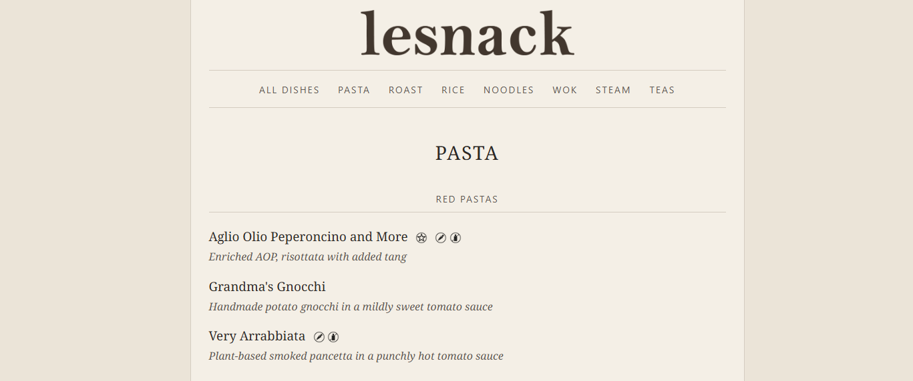

# Lesnack

**Live site:** https://thelazyone.github.io/lesnack/


The recipe of the Jack and Nan household.




## Setup

Requires [Zola 0.19+](https://www.getzola.org/documentation/getting-started/installation/).
 
```powershell
git clone --depth 1 https://github.com/thelazyone/walnuts-n-zola themes/walnuts-n-zola
```

For local development run `zola serve` and open http://127.0.0.1:1111 

## Deploy

The site is hosted on GitHub Pages. Pushes to `main` build and deploy automatically via GitHub Actions (`.github/workflows/deploy.yml`).

1. In the repo **Settings → Pages**, set source to **GitHub Actions**.
2. Push to `main`.
